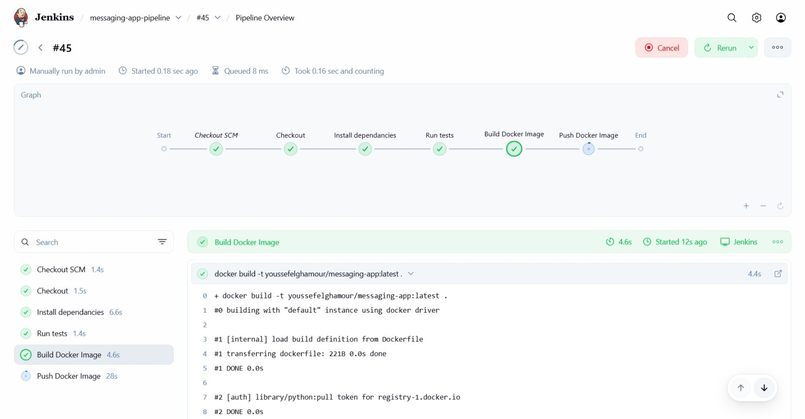

# Jenkins Local Setup Guide

Setting up Jenkins locally using Docker so I can run pipelines for my projects, including building Docker images and running Python tests.

## 1. Run Jenkins with Docker

Run Jenkins in a Docker container using:

```bash
docker run -d \
    --name jenkins \
    -p 8080:8080 -p 50000:50000 \
    -v jenkins_home:/var/jenkins_home \
    --user root \
    jenkins/jenkins:lts
```

- `-p 8080:8080` exposes the Jenkins web UI.
- `-p 50000:50000` allows Jenkins agents to connect.
- `-v jenkins_home:/var/jenkins_home` persists Jenkins configuration and job history across container restarts.  
- `--user root` ensures you can install packages inside the Jenkins node container.

After this, access Jenkins at `http://localhost:8080`.

## 2. Install Dependencies Inside Jenkins Node

Enter the Jenkins container and install the tools needed for the tests:

```bash
docker exec -it jenkins bash  
apt-get update && apt-get install -y docker.io python3 python3-venv python3-pip
```

- Docker is needed to build and push images from the pipeline.  
- Python, pip, and venv are required to run tests and manage dependencies inside a virtual environment.

## 3. Add Credentials in Jenkins UI

Go to **Jenkins Dashboard → Manage Jenkins → Credentials** and add:  

- **GitHub credentials** (`github-credentials`) – username & personal access token; allows Jenkins to clone private repos.  
- **Database credentials** (`db_credentials`) – username & password; used by the pipeline to connect to the test database.  
- **Database info** (`db_name`, `db_host`, `db_port`) – secret text; provides the database name, host, and port for tests.  
- **Docker Hub credentials** (`dockerhub`) – username & password; allows Jenkins to push Docker images.

## 4. Run the Pipeline

Create a new pipeline job in Jenkins, point it to `messaging_app/Jenkinsfile`, and trigger it manually or automatically on repository events.

