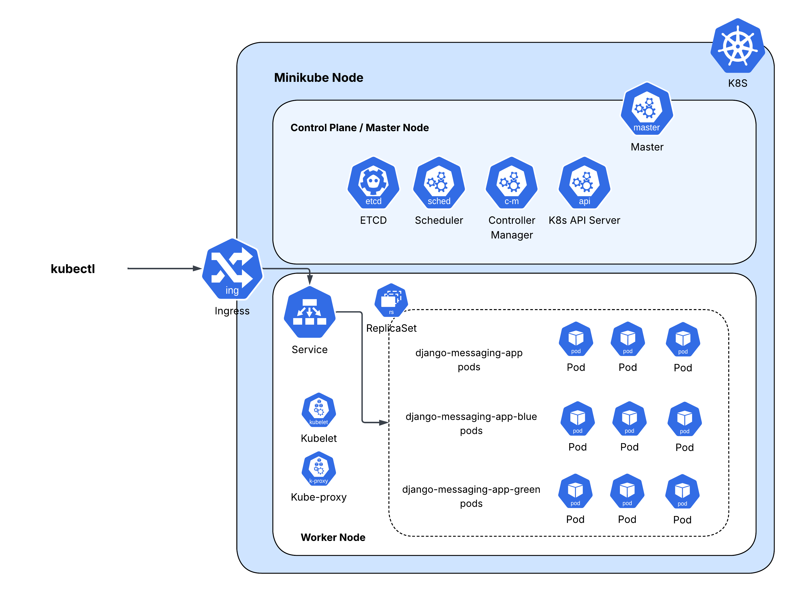

# Kubernetes Project Guide



## Prerequisites

- **Minikube** installed (for local Kubernetes cluster)
- **kubectl** installed (Kubernetes CLI)
- **Docker** installed (for building images)


## 1. Start Local Kubernetes Cluster

Starts a Kubernetes cluster locally composed of one node acting as both master and worker:

```bash 
minikube start --driver=docker
```


## 2. Deploy Django App

Create a deployment file and create a deployment:

```bash 
kubectl apply -f deployment.yaml
```

> This might not work, causes an error with the image pull: the image is local to our PC in Docker, not in the Docker environment of Minikube. So run this to tell our current terminal to use the Docker of Minikube, not the local Docker:

```bash 
eval $(minikube -p minikube docker-env)
```

> Now all Docker commands will use the Minikube Docker.

Then we have to rebuild the image inside Minikube:

```bash 
docker build -t messaging_app-web .
```


## 3. Verify Deployment

Now we have a deployment with a pod and a service:

```bash 
kubectl apply -f deployment.yaml
```

Check pods:

```bash 
kubectl get pods
```

Check services:

```bash 
kubectl get services
```

> Example output:
>
> ```
> NAME                                    READY   STATUS    RESTARTS   AGE
> django-messaging-app-6b5779bf54-49nhf   1/1     Running   0          5s
>
> NAME             TYPE        CLUSTER-IP       EXTERNAL-IP   PORT(S)    AGE
> django-service   ClusterIP   10.105.126.160   <none>        8000/TCP   9s
> kubernetes       ClusterIP   10.96.0.1        <none>        443/TCP    25h
> ```


## 4. Optional: Expose App to Browser

Expose the internal service so we can access the app from the browser:

```bash 
kubectl port-forward service/django-service 8000:8000
```

> Accessible at: http://localhost:8000/api/


## 5. Scaling

Scaling is just adding replicas in our ReplicaSet—basically just increasing the number of pods.

> We used `kubectl scale` in the `kubctl-0x01` file, which also logs resource usage using `kubectl top` from metrics API.


## 6. Enable Ingress (Expose App Externally)

Enable ingress that uses Nginx by default:

```bash 
minikube addons enable ingress
```

Run the ingress.yaml file to apply/create the ingress resource:

```bash 
kubectl apply -f ingress.yaml
```

Show the ingress created:

```bash 
kubectl get ingress
```

Show details of the ingress:

```bash 
kubectl describe ingress django-ingress
```

> It shows that it load balances traffic to the pods we have through our service we created.

Get the public IP of Minikube:

```bash 
minikube ip
```

Start a tunnel that gives a public IP of the Minikube cluster:

```bash 
minikube tunnel
```

> Now our app is accessible at http://localhost/api/

If it’s not, change the service type to LoadBalancer:

```bash 
kubectl patch svc django-service -p '{"spec":{"type":"LoadBalancer"}}'
```

To see the type of the service:

```bash 
kubectl get svc
```

Run this if you ever want to edit the service (ClusterIP ↔ LoadBalancer). It opens the file in vim; just edit, save, and exit to apply:

```bash 
kubectl edit svc django-service
```


## 7. Blue-Green Deployment

**What is Blue-Green Deployment?**

Blue-Green Deployment is a deployment strategy that allows you to release a new version of your application with **zero downtime**. Instead of updating existing pods gradually (like a rolling update), you maintain **two separate environments**:

- **Blue environment** → current production version
- **Green environment** → new version to be deployed

Traffic is initially routed to the Blue environment. Once the Green environment is ready and tested, you **switch the service to point to the Green pods**, effectively making the new version live **all at once**. This ensures:

- No downtime during deployment
- Quick rollback if something goes wrong (you can switch back to Blue)
- Easy testing of the new version before making it live

In our project, we apply this method by creating a new Docker image tagged as `green`, deploying it alongside the existing Blue pods, and then updating the Kubernetes Service to route traffic to the Green pods.

---

**Step 1: Build the Green image**

We need a new version of our app image, using the same image but tagged as `green`:
```bash 
docker build -t messaging_app-web:green .
```


**Step 2: Deploy Blue and Green versions**

Run the `kubctl-0x02` script, which:

- Applies `blue_deployment.yaml` → creates Blue pods  
- Applies `green_deployment.yaml` → creates Green pods  
- Applies `kubeservice.yaml` → initially routes traffic to Blue pods  
- Waits for pods to start and checks logs  
- Switches traffic to Green by patching the service  

> After running `kubctl-0x02`, the cluster has **3 Blue pods + 3 Green pods** + the 3 old pods.  
> Initially, traffic is served by the **Blue pods**. Only after switching the service does traffic go to the Green pods.


**Step 3: Verify the service version**

Check which version the service is pointing to:

```bash 
kubectl get svc django-service -o yaml
```

> Look under `spec.selector.version`. It should show `green` after switching.

**Step 5: Check which pods are actually serving traffic**

To verify that traffic is routed to the Green pods:

1. List the endpoints of the service:

```bash 
kubectl get endpoints django-service
```

> This shows the IPs of the pods that the service is currently sending traffic to.

2. List all pods with their IPs:

```bash 
kubectl get pods -o wide
```

> By comparing the IPs from the endpoints with the pod IPs, you can confirm which pods (Blue or Green) are serving traffic. Only the Green pods should match the service endpoints after switching.


---

Optionally, do this gradually by downscaling blue while upscaling green:

```bash 
# Scale green up
kubectl scale deployment django-green --replicas=1
# Scale blue down
kubectl scale deployment django-blue --replicas=2

# Repeat until green=3, blue=0
kubectl scale deployment django-green --replicas=2
kubectl scale deployment django-blue --replicas=1

kubectl scale deployment django-green --replicas=3
kubectl scale deployment django-blue --replicas=0
```


## 8. Rolling Update

> Rolling update: old Pods are replaced gradually by new ones in the same Deployment. No separate environment; traffic shifts automatically.  

> Blue-Green deployment: two separate environments (Blue = old, Green = new). Switch traffic from Blue to Green all at once via a Service update like we did previously or Ingress.

Make a new image version:

```bash 
docker build -t messaging_app-web:2.0 .
```

Run the script `kubctl-0x03` to start the rolling update.

After that, check that the new pods are using the new image:

```bash 
kubectl describe pod <pod-name> | grep Image
```